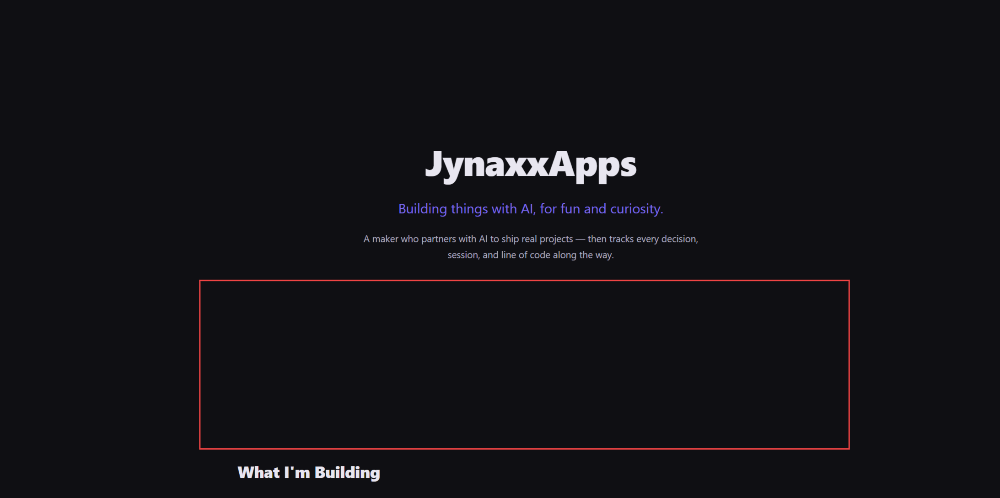

# Reduce spacing between hero section and "What I'm Building"

**Source:** https://jynaxxapps.com/
**Captured:** 2026-03-12T17:41:26.719Z
**Project:** JynaxxApps Landing

## What I'm Seeing
There's a bunch of space between the Janux app title and sub context there, and what I'm building. Can we squeeze that a little bit because it feels like I have to scroll this user too far and I shouldn't have to do that to start? Or maybe have an arrow pointing down that invites the user to go and see it beyond the fold. I think we have to tighten that up a little bit.

## Screenshot

## Scope
Reduce vertical spacing in the hero section (between the title/subtitle area and the "What I'm Building" section) so the project cards are visible sooner. Alternatively or additionally, add a scroll-down indicator (e.g. a downward arrow) to invite users below the fold.

## What NOT To Do
- Do not change anything outside the hero section spacing or scroll indicator
- Do not refactor surrounding code unless directly required

## Acceptance Criteria
- [ ] The "What I'm Building" heading is visible with less scrolling from the initial viewport
- [ ] Either spacing is tightened OR a scroll-down indicator is added (confirm approach with Michael)
