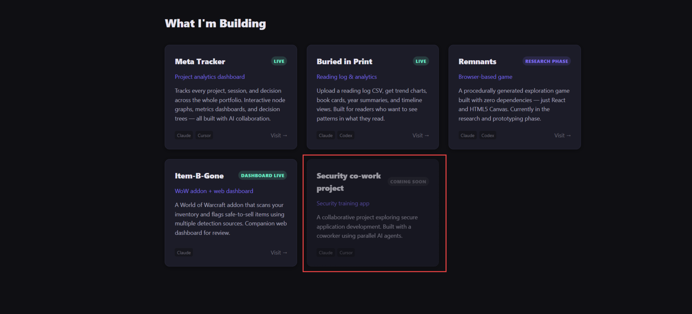

# Add dotted "under construction" border to the Coming Soon card

**Source:** https://jynaxxapps.com/
**Captured:** 2026-03-12T17:42:19.361Z
**Project:** JynaxxApps Landing

## What I'm Seeing
I like the slightly faded look to this card. That's really cool. Can we put a white or slightly brighter dotted line around this box that makes the user feel like it's under construction? We're temporary in some way. That way they have a better call out for what that box is supposed to or not supposed to be.

## Screenshot

## Scope
Add a white or light-colored dotted border to the "Security co-work project" (Coming Soon) card to visually communicate that it's under construction / not yet available.

## What NOT To Do
- Do not change anything outside the Coming Soon card styling
- Do not alter the existing faded appearance — it should be preserved
- Do not refactor surrounding code unless directly required

## Acceptance Criteria
- [ ] The Coming Soon card has a visible white/bright dotted border
- [ ] The border conveys an "under construction" or "temporary" feel
- [ ] The existing faded card style is preserved
